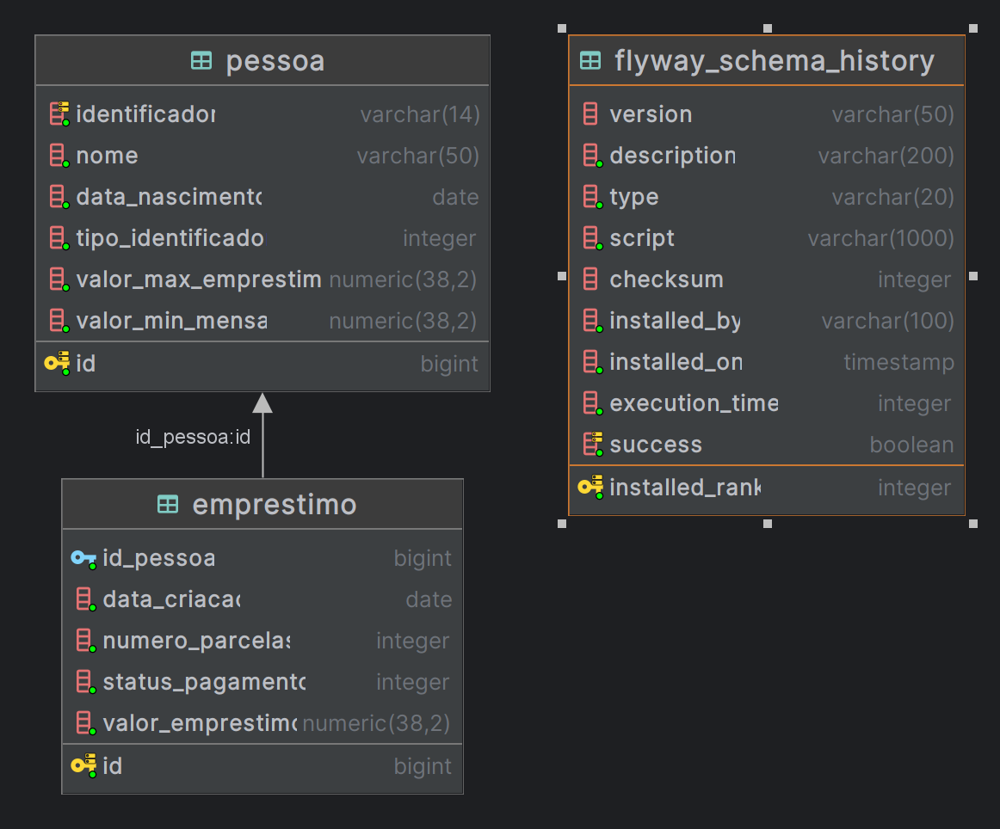

# **API REST Votação de Assembleias**

## **Índice**
- [Autor](#autor)
- [Apresentação](#apresentação)
- [Sobre a Solução](#sobre-a-solução)
- [Funcionalidades Técnicas](#funcionalidades-técnicas)
- [Arquitetura](#arquitetura)
- [Modelagem de Dados](#modelagem-de-dados)
- [Tecnologias Utilizadas](#tecnologias-utilizadas)
- [Versionamento](#versionamento)
- [Pré-requisitos](#pré-requisitos)
- [Execução](#execução)
- [Postman](#postman)
- [RabbitMQ](#rabbitmq)
- [Postgres](#postgres)
- [Swagger-UI](#swagger-ui)
- [Testes executados](#testes-executados)
- [Ideias para implementação](#ideias-para-implementação)


## Autor
 
### Douglas de Sousa Santos
- [](dsousasantos91@gmail.com)
- [](https://github.com/dsousasantos91)


# Apresentação

Olá equipe de Recrutamento,

Gostaria de agradecer a oportunidade de participar do desafio de processo seletivo para a posição de Desenvolvedor Backend. Foi uma experiência empolgante e enriquecedora desenvolver o serviço de gestão de empréstimos REST.

# Sobre a Solução

Para cumprir o desafio, decidi utilizar a linguagem de programação Java, com o framework Spring e o banco de dados Postgres. Essa escolha foi motivada pela minha experiência prévia e pela agilidade que essas ferramentas proporcionam no desenvolvimento de APIs RESTful.

A solução desenvolvida consiste em um serviço REST completo, capaz de realizar o cadastro de pessoas e a solicitação de empréstimos. Utilizei endpoints simples e intuitivos para cada uma dessas funcionalidades, seguindo os princípios de design de APIs RESTful.

# Funcionalidades Técnicas

## Cadastro de Pessoas

### Descrição:
O endpoint de cadastro de pessoas permite a inclusão de novos registros de indivíduos em nosso sistema. As informações pessoais são fornecidas pelo usuário e armazenadas em um banco de dados para posterior consulta e análise.

### Endpoint:
- **Método HTTP:** POST
- **URL:** `/api/v1/pessoas`

### Parâmetros:
- `nome` (string): Nome completo da pessoa.
- `identificador` (string): Número de CPF, CNPJ, EU (Estudante Universitário) ou AP (Aposentado) podendo conter de 8 a 14 caracteres.
- `data_nascimento` (string): Data de nascimento da pessoa (formato: DD/MM/YYYY).

### Retorno:
- **Status 200 OK:** Cadastro realizado com sucesso.
- **Status 400 Bad Request:** Erro de validação nos dados fornecidos.
- **Status 500 Internal Server Error:** Erro interno no servidor.

## Solicitação de Empréstimo

### Descrição:
O endpoint de solicitação de empréstimo permite que os clientes submetam suas solicitações de empréstimo, especificando o identificador, valor desejado e quantidade de parcelas. Essas solicitações são registradas no sistema para análise e processamento posterior.

### Endpoint:
- **Método HTTP:** POST
- **URL:** `/api/v1/emprestimos`

### Parâmetros:
- `identificador` (integer): Identificador único do cliente que está solicitando o empréstimo.
- `valorEmprestimo` (float): Valor desejado para o empréstimo.
- `numeroParcelas` (integer): Prazo desejado para o pagamento do empréstimo (em meses).

### Retorno:
- **Status 200 OK:** Solicitação de empréstimo registrada com sucesso.
- **Status 400 Bad Request:** Erro de validação nos dados fornecidos.
- **Status 404 Not Found:** Erro de validação de identificador inexiatente.
- **Status 500 Internal Server Error:** Erro interno no servidor.


Essas e outras funcionalidades podem ser vizualizadas na documentação acessando [Swagger-UI](http://localhost:8080) ao executar o projeto local ou via docker-compose.

# Arquitetura

A arquitetura é composta por:

- MICROSERVICE (JAVA/SPRING);
- MESSAGE BROKER (RABBITMQ);
- DATABASE (POSTGRES);
- CONTAINERS (DOCKER)

# Modelagem de Dados



## Descrição do Relacionamento

O relacionamento entre as tabelas `pessoa` e `emprestimo` é essencial para o gerenciamento eficaz de empréstimos concedidos a indivíduos. Aqui está uma explicação detalhada desse relacionamento:

1. **Tabela Pessoa:**
   - A tabela `pessoa` armazena informações sobre os clientes ou indivíduos que têm acesso ao sistema de empréstimos.
   - Cada registro na tabela `pessoa` representa um cliente cadastrado, com campos como `id`, `nome`, `identificador`, `data_nascimento`, `tipo_identificador`, `valor_min_mensal`, `valor_max_emprestimo`, entre outros.
   - A coluna `tipo_identificador` na tabela `pessoa` indica a categoria ou tipo de cliente, que pode ser "PF" (Pessoa Física), "PJ" (Pessoa Jurídica), "EU" (Estutante Universitário) ou "AP" (Aposentado), por exemplo.
   - O tipoIdentificador de uma pessoa determina o limite de crédito disponível para empréstimos.

2. **Tabela Empréstimo:**
   - A tabela `emprestimo` registra todos os empréstimos concedidos aos clientes.
   - Cada registro na tabela `emprestimo` representa um empréstimo específico, com campos como `id`, `id_pessoa`, `data_criacao`, `numero_parcelas`, `status_pagamento` e `valor_emprestimo`.
   - A coluna `id_pessoa` na tabela `emprestimo` estabelece uma chave estrangeira referenciando a tabela `pessoa`, indicando o cliente associado ao empréstimo.
   - O campo `valor_emprestimo` representa o montante do empréstimo concedido.
   - O campo `status_pagamento` pode indicar se o empréstimo está em processamento ou foi pago.

## Restrição de Limite de Crédito

- Uma pessoa pode fazer vários empréstimos desde que não ultrapasse o limite disponível para seu tipo de identificador.
- Antes de conceder um novo empréstimo a um cliente, o sistema deve verificar a diferença entre o valor total dos empréstimos existentes e o valor máximo permitido para o tipo de identificador da pessoa para não exceder o limite de crédito disponível no momento.
- Caso o limite de crédito seja ultrapassado, o sistema rejeita a solicitação de empréstimo e aplicar uma lógica de gerenciamento de risco para lidar com a situação.

## Exemplo de Relacionamento

- João é uma pessoa física com categoria "PF" e possui um limite de crédito de R$ 10.000,00.
- João solicita um empréstimo de R$ 5.000,00, que é aprovado e registrado na tabela `emprestimo`.
- João solicita outro empréstimo de R$ 6.000,00. Antes de aprovar o novo empréstimo, o sistema verifica a diferença entre valor total dos empréstimos existentes (R$ 5.000,00) e o valor máximo de crédito para o seu tipo de identificador (R$ 10.000,00) restanto assim o valor disponível de R$ 5.000,00. Portanto, o sistema rejeita a solicitação do segundo empréstimo.

# Tecnologias Utilizadas

Para implementar o projeto, foram utilizadas as seguintes tecnologias e ferramentas:

- **Java 11:** A linguagem de programação principal do projeto, conhecida por sua robustez e versatilidade.
- **Spring Framework (Spring MVC, Spring Boot, Spring Cloud, Spring Data):** Um conjunto de ferramentas que facilitam o desenvolvimento de aplicativos Java, proporcionando recursos como injeção de dependência, controle de transações, desenvolvimento de APIs RESTful, integração com bancos de dados e muito mais.
- **SpringFox 3 (Swagger):** Uma biblioteca que simplifica a geração de documentação interativa para APIs RESTful desenvolvidas com o Spring Framework.
- **JUnit 5:** Uma estrutura de teste de unidade para a linguagem de programação Java.
- **Maven:** Uma ferramenta de automação de compilação e gerenciamento de dependências para projetos Java.
- **H2:** Um banco de dados em memória que pode ser facilmente integrado a aplicativos Java para desenvolvimento e teste.
- **Flyway:** Uma ferramenta de migração de banco de dados que permite controlar e automatizar as alterações no esquema do banco de dados ao longo do tempo.
- **PostgreSQL:** Um sistema de gerenciamento de banco de dados relacional de código aberto conhecido por sua confiabilidade e desempenho.
- **RabbitMQ:** Um software de mensageria que implementa o protocolo Advanced Message Queuing Protocol (AMQP), utilizado para comunicação assíncrona entre componentes do sistema.
- **Docker:** Uma plataforma de software que facilita a criação, implantação e execução de aplicativos em contêineres virtualizados.

Essas tecnologias foram escolhidas com base em minha expertise além de sua maturidade, popularidade e capacidade de atender aos requisitos de desenvolvimento do projeto, proporcionando eficiência, escalabilidade e manutenibilidade.

## Versionamento

A estratégia de versionamento usada foi Semantic Versioning (ou SemVer) que é um sistema de numeração de versões usado para indicar mudanças no código e na funcionalidade de um programa. Estabelece um padrão claro e consistente na forma como as versões são numeradas e como as alterações em um software são comunicadas aos desenvolvedores e usuários.

O sistema de versionamento semântico é composto por três números principais, dispostos na seguinte ordem: "MAJOR.MINOR.PATCH".
- **MAJOR:** Representa versões principais do software e é incrementado quando mudanças incompatíveis com versões anteriores são feitas. Isso significa que alterações que quebram a compatibilidade com versões anteriores, como mudanças na API ou remoção de funcionalidades, levarão ao aumento do número MAJOR.
- **MINOR:** Indica a adição de novas funcionalidades ou melhorias que são compatíveis com versões anteriores. Quando um novo recurso é adicionado ao software, o número MINOR é incrementado. Geralmente, isso não causa quebras em sistemas que usam a versão anterior.
- **PATCH:** Indica correções de bugs e pequenas melhorias que não afetam a compatibilidade com versões anteriores. A cada correção de bug ou ajuste pequeno, o número PATCH é incrementado.

O projeto foi gerado com a versão 1.0.0, pois entendo que essa versão representa a primeira entrega de um produto (desafio) ou MVP.

# Pré-requisitos

- Java 11;
- Docker *(RabbiMQ e Postgres)*;
- IDEs Intellij IDEA, Spring Tools Suite ou VSCode *(Opcional - apenas para alterações no código)*;
- Postman *(Opcional)*;

## Execução

Para execurtar o projeto local é necessário o Docker e Docker-compose.

Execute o comando abaixo dentro do diretório raiz do projeto para carregar o serviço completo com `docker-compose`:

```
docker-compose up -d
```

Para executar o projeto separadamente (IDE ou linha de comando) execute:

```
docker-compose -f .\docker-compose-infra.yml up -d
```

*Windows*
```
.\mvnw.cmd spring-boot:run -Dspring-boot.run.profiles=dev
```
*Linux*
```
./mvnw spring-boot:run -Dspring-boot.run.profiles=dev
```

## Postman

Todas as requisições estão disponíveis para execução no arquivo  `Emprestimo.postman_collection` basta importar no Postman.
Existe também no repositório, o arquivo de configuração de ambiente para importar, contendo os valores da variável `url` local (`local.postman_environment.json`).

## RabbitMQ

- [http://localhost:15672](http://localhost:15672)
- **User:** admin
- **Password:** admin

## Postgres

#### PGAdmin
  - [http://localhost:5050](http://localhost:5050/)
  - **User:** admin@admin.com
  - **Password:** root

#### Dados para conectar no servidor:
  - **User:** postgres
  - **Password:** postgres

## Swagger-UI

- [Local](http://localhost:8080/swagger-ui/index.html#/)

## **Testes executados**

Além dos teste funcionais através da ferramenta `Postman` para garantir que os requisitos foram atendidos (Cadastrar Pessoa e Solicitar Empréstimo) também foram realizados testes como:

- Unitários com as bibliotecas JUnit 5, Mockito e Hamcrest com 100% de cobertura de testes nas classes com regras de negócio (Services).
- Teste de performance com Postman.

**OBS.:** O arquivo com resultado dos testes funcionais realizando 10 interações com intervalo de 2 segundos em sequencia estão no arquivo `Emprestimo.postman_test_run.json`

## **Ideias para implementação**

- **Testes de Integração com H2 e Test-Containers:**

  O teste de integração, envolvendo o uso do H2 no contexto de testes e abrangendo desde as camadas de Controller até as camadas de persistência e base de dados, demandaria um prazo um pouco maior para sua implementação. Essa abordagem é crucial para garantir que todas as partes do sistema estejam funcionando corretamente em conjunto.

  Além disso, uma estratégia adicional que pode ser adotada para aumentar a confiabilidade dos testes é o uso do `test-container`. Esta abordagem permite testar a integração com serviços externos, como o PostgreSQL e o RabbitMQ, garantindo que o sistema funcione adequadamente em um ambiente mais próximo do ambiente de produção. A implementação desses testes também poderia ser considerada, proporcionando uma cobertura mais abrangente e confiável.

